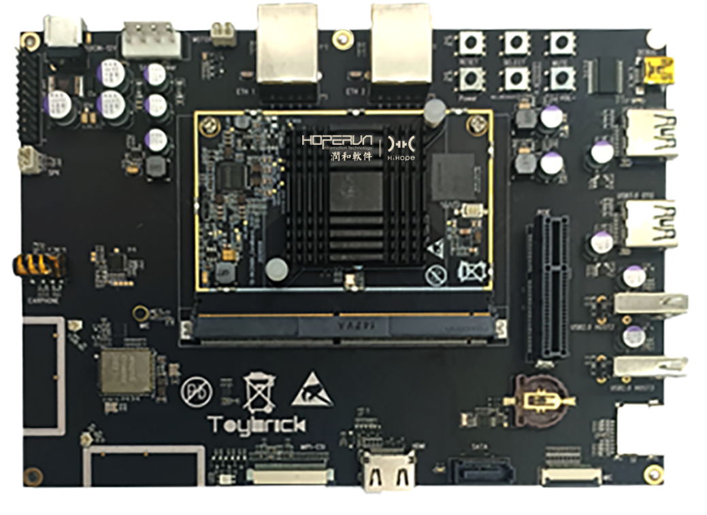
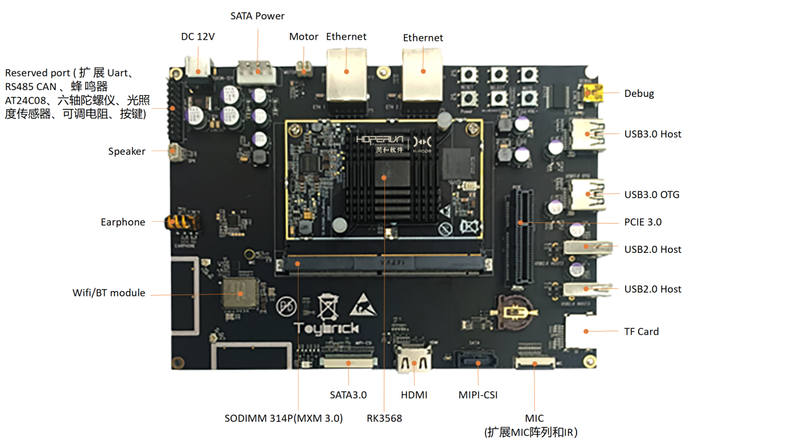
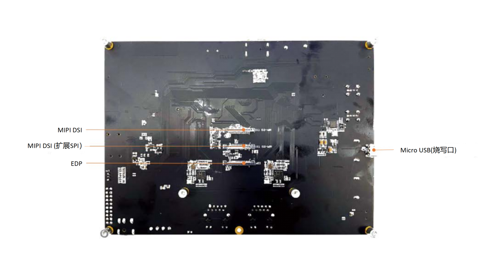
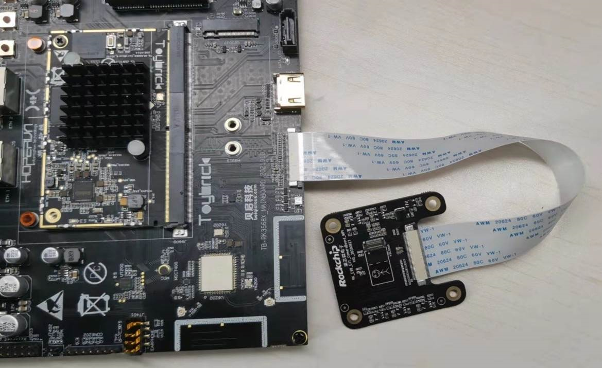
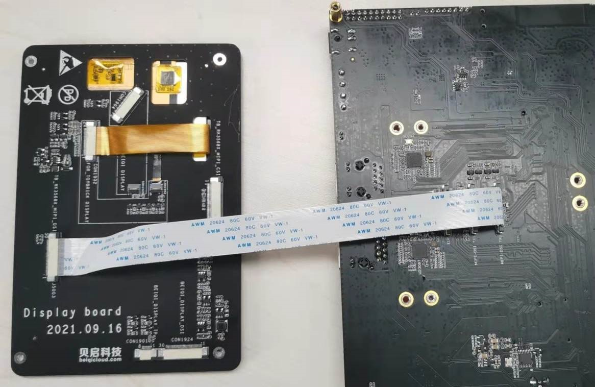

# 【开发板名称】润和HH-SCDAYU200开发套件

**简介**

润和HH-SCDAYU200是基于Rockchip
RK3568，集成双核心架构GPU以及高效能NPU；板载四核64位Cortex-A55
处理器采用22nm先进工艺，主频高达2.0GHz；支持蓝牙、Wi-Fi、音频、视频和摄像头等功能，拥有丰富的扩展接口，支持多种视频输入输出接口；配置双千兆自适应RJ45以太网口，可满足NVR、工业网关等多网口产品需求。

润和HH-SCDAYU200开发板外观图如图1所示：

****

图1：润和HH-SCDAYU200开发板外观图

**一、开发板详情**

**1、润和HH-SCDAYU200开发板正面外观图**

****

图2：润和HH-SCDAYU200开发板正面外观图

2、**润和HH-SCDAYU200开发板反面外观图**

****

图3：润和HH-SCDAYU200开发板反面外观图

**3、接口复用说明**

**·** BT1120：将 GMAC1 相关引脚用于 BT1120,则能实现 BT1120
相关输出（目前底板上没有留BT1120接口）。

· PCIE：目前有 1x 2Lanes PCIe3.0 Connector (RC Mode)，如果想增加
PCIE2.0,将MULTI_PHY2配置为 PCIE模式。

· SATA：目前有1x SATA3.0，也可以通过配置 MULTI_PHY0、MULTI_PHY1为
SATA,就能实现3x SATA3.0。

· RGMII：目前有2x RGMII,如果想增加QSGMII,需要将MULTI_PHY1、MULTI_PHY2
配置为QSGMII。

**二、开发板规格**

Rockchip RK3568采用四核64位Cortex-A55
处理器，主频高达2.0GHz；采用22nm先进工艺，具有低功耗高性能的特点，可广泛应用于嵌入式人工智能领域。

润和HH-SCDAYU200开发板MCU/处理器规格及规格清单如表1所示：

<table>
   <tr>
        <td rowspan="2">芯片</td> 
        <td>Rockchip RK3568 芯片</td> 
   </tr>
   <tr>
        <td >Quad-core Cortex-A55</td>  
    </tr>
   <tr>
        <td>架构</td> 
        <td>ARM</td> 
   </tr>
    <tr>
        <td>主频</td> 
        <td>2.0GHz</td> 
   </tr>
    <tr>
        <td>工作电压</td> 
        <td>12V/2A</td> 
   </tr>
    <tr>
        <td>内存&存储</td> 
        <td>2GB LPDRR4、 32GB EMMC</td> 
   </tr>
   <tr>
        <td rowspan="5">通用规格</td>    
        <td >支持OpenHarmony、Linux系统</td>  
    </tr>
    <tr>
        <td >双网口：可通过双网口访问和传输内外网的数据，提高网络传输效率</td>  
    </tr>
    <tr>
        <td >多屏异显：最多可以满足三屏异显功能</td>  
    </tr>
    <tr>
        <td >核心板尺寸 82mm×60mm，可满足小型终端产品空间需求</td>  
    </tr>
    <tr>
        <td >丰富的扩展接口，支持多种视频输入输出接口（详见底板规格说明）</td>  
    </tr>
</table>

表1 润和HH-SCDAYU200开发板MCU/处理器规格及规格清单

润和HH-SCDAYU200开发板底板规则说明如表2所示：

| **HH-SCDAYU200底板规格说明**   |                                                                                                                |
|------------------------------|----------------------------------------------------------------------------------------------------------------|
| 显示接口                     | 1x HDMI2.0(Type-A)接口，支持4K/60fps输出  2x MIPI接口，支1920\*1080@60fps输出  1x eDP接口，支持2K@60fps输出    |
| 音频接口                     | 1x 8ch I2S/TDM/PDM  1x HDMI音频输出  1x 喇叭输出  1x 耳机输出  1x 麦克风，板载音频输入                         |
| 以太网                       | 2x GMAC(10/100/1000M)                                                                                          |
| 无线网络                     | SDIO接口，支持WIFI6 5G/2.5G,BT4.2                                                                              |
| 摄像头接口                   | MIPI-CSI2, 1x4-lane/2x2-lane@2.5Gbps/lane                                                                      |
| USB                          | 2x USB2.0 Host,Type-A  1x USB3.0 Host,Type-A  1x USB3.0 OTG                                                    |
| PCIe                         | 1x 2Lanes PCIe3.0 Connector (RC Mode)                                                                          |
| SATA                         | 1x SATA3.0 Connector                                                                                           |
| SDMMC                        | 1x Micro SD Card3.0                                                                                            |
| 按键                         | 1x Vol+/Recovery  1x Reset  1x Power  1x Vol-  1x Mute                                                         |
| 调试                         | 1x 调试串口                                                                                                    |
| RTC                          | 1x RTC                                                                                                         |
| IR                           | 1x IR                                                                                                          |
| 三色灯                       | 3x LED                                                                                                         |
| G-sensor                     | 1x G-sensor                                                                                                    |
| FAN                          | 1x Fan                                                                                                         |
| 扩展接口                     | 20Pin扩展接口包括： 2x ADC接口 2x I2C接口 7x GPIO口（或者3x gpio + 4x uart信号） 3x VCC电源（12V、3.3V、5V）） |
| 底板尺寸                     | 180mm×130mm                                                                                                    |
| PCB 规格                     | 4 层板                                                                                                         |

表2 润和HH-SCDAYU200开发板底板规则说明

**三、开发板功能**

**·** 核心板采用6层布线工艺，尺寸仅82mm×60mm，可满足小型终端产品空间需求

**·** 高性价比：适合中小规模企业/用户使用

· 双网口：可通过双网口访问和传输内外网数据，提高网络传输效率

· 多屏异显：最多可以满足三屏异显功能

· 支持多系统：支持OpenHarmony、Linux系统。

**四、开发板配件安装：**

**1、摄像头模组安装如下图：**

**2、Mipi 屏幕安装如下图：**

**五、开发板应用场景**

润和HH-SCDAYU200开发板适用于智能NVR、云终端、物联网网关、工业控制、信息发布终端、多媒体广告机等场景，亦可广泛应用于嵌入式人工智能领域。

**六、搭建开发环境**

**1、安装依赖工具**

安装命令如下：

sudo apt-get update && sudo apt-get install binutils git git-lfs gnupg flex
bison gperf build-essential zip curl zlib1g-dev gcc-multilib g++-multilib
libc6-dev-i386 lib32ncurses5-dev x11proto-core-dev libx11-dev lib32z1-dev ccache
libgl1-mesa-dev libxml2-utils xsltproc unzip m4 bc gnutls-bin python3.8
python3-pip ruby

**说明：** 
以上安装命令适用于Ubuntu18.04，其他版本请根据安装包名称采用对应的安装命令。

**2、获取标准系统源码**

**前提条件**

1）注册码云gitee账号。

2）注册码云SSH公钥，请参考[码云帮助中心](https://gitee.com/help/articles/4191)。

3）安装[git客户端](http://git-scm.com/book/zh/v2/%E8%B5%B7%E6%AD%A5-%E5%AE%89%E8%A3%85-Git)和[git-lfs](https://gitee.com/vcs-all-in-one/git-lfs?_from=gitee_search#downloading)并配置用户信息。

git config --global user.name "yourname"

git config --global user.email "your-email-address"

git config --global credential.helper store

4）安装码云repo工具，可以执行如下命令。

curl -s https://gitee.com/oschina/repo/raw/fork_flow/repo-py3 \>
/usr/local/bin/repo \#如果没有权限，可下载至其他目录，并将其配置到环境变量中

chmod a+x /usr/local/bin/repo

pip3 install -i https://repo.huaweicloud.com/repository/pypi/simple requests

**获取源码操作步骤**

1） 通过repo + ssh 下载（需注册公钥，请参考码云帮助中心）。

repo init -u git@gitee.com:openharmony/manifest.git -b master --no-repo-verify

repo sync -c

repo forall -c 'git lfs pull'

2） 通过repo + https 下载。

repo init -u https://gitee.com/openharmony/manifest.git -b master
\--no-repo-verify

repo sync -c

repo forall -c 'git lfs pull'

**执行prebuilts**

在源码根目录下执行脚本，安装编译器及二进制工具。

bash build/prebuilts_download.sh

下载的prebuilts二进制默认存放在与OpenHarmony同目录下的OpenHarmony_2.0_canary_prebuilts下。

**七、编译调试**

**1、编译**

在Linux环境进行如下操作:

1） 进入源码根目录，执行如下命令进行版本编译。

./build.sh --product-name rk3568 –ccache

2） 检查编译结果。编译完成后，log中显示如下：

post_process

=====build rk3568 successful.

2021-09-13 09:22:28

编译所生成的文件都归档在out/ohos-arm-release/目录下，结果镜像输出在
out/ohos-arm-release/packages/phone/images/ 目录下。

3） 编译源码完成，请进行镜像烧录。

**2、烧录工具**

烧写工具下载及使用。

[参考](https://gitee.com/hihope_iot/docs/tree/master/HiHope_DAYU200/%E7%83%A7%E5%86%99%E5%B7%A5%E5%85%B7%E5%8F%8A%E6%8C%87%E5%8D%97)

**八、联系**

合作伙伴购买链接：

https://item.taobao.com/item.htm?spm=a2126o.success.result.1.68054831IdfpG7&id=655971020101

